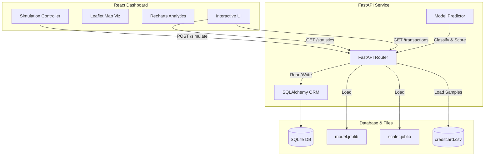

# Real-Time Credit Card Fraud Detection System Report

This document details the architecture, machine learning pipeline, tech stack, execution modes, and simulation functionality of the **Real-Time Credit Card Fraud Detection System**.

---

## 🏗️ System Architecture

The application is structured as a full-stack, decoupled architecture that connects an interactive front-end dashboard with a FastAPI machine learning backend.



---

## 🛠️ Technology Stack

### 1. Frontend (Dashboard)
- **Vite + React.js**: Lightweight, ultra-fast build tool and interactive UI framework.
- **Leaflet & React-Leaflet**: Renders maps with visual markers representing transaction coordinates.
- **Recharts**: Displays real-time category distribution bars and hourly fraud trend charts.
- **Lucide React**: Clean, modern iconography.
- **Axios**: Communicates asynchronously with the backend API.

### 2. Backend (REST API)
- **FastAPI**: Modern, high-performance web framework for building APIs in Python.
- **SQLAlchemy & SQLite**: ORM database layer for storing and querying incoming transactions.
- **Uvicorn**: ASGI web server implementation.

### 3. Machine Learning (Data Science)
- **RobustScaler**: Used to scale transaction `Time` and `Amount` values (robust against extreme outliers).
- **SMOTE (Synthetic Minority Over-sampling Technique)**: Balances class distribution by oversampling minority fraud cases to 10% of the majority class.
- **Scikit-learn, XGBoost, LightGBM**: Algorithm implementations compared during model training.
- **Joblib**: Serializes/deserializes the trained model and scaler assets.

---

## 🧪 Machine Learning Pipeline & Training

The training script located in [train.py](file:///d:/FRAUD%20detection/model/train.py) processes the Kaggle `creditcard.csv` dataset and compares three machine learning classifiers.

1. **Preprocessing**: Scaling `Time` and `Amount` features, keeping other PCA components ($V1-V28$) intact.
2. **SMOTE**: Balances the training split to handle severe class imbalance (where fraud represents $< 0.2\%$ of total transactions).
3. **Training & Comparison**: Fits three models:
   - **Random Forest Classifier**
   - **XGBoost Classifier**
   - **LightGBM Classifier**
4. **Best Model Selection**: Evaluates all models on a stratified 20% test split. The model with the highest **F1-Score** is selected, saved as `model.joblib`, and served by the API.

### Evaluation Results (Best Model: Random Forest)
- **Accuracy**: 99.9350%
- **Precision**: 76.9912%
- **Recall**: 88.7755%
- **F1-Score**: 82.4645%
- **ROC-AUC**: 0.977382

---

## 🚀 How to Run the Project

You can run the project in two different environments: **Docker** (recommended for production/containers) or **Locally** (recommended for development).

### Option A: Using Docker Compose (Recommended)
Docker containerizes the frontend React app and backend FastAPI server, running them as isolated services.

1. Make sure **Docker Desktop** is open and running on your system.
2. Open a terminal in the root directory and run:
   ```bash
   docker-compose up --build
   ```
3. Open your browser:
   - **React Dashboard**: Visit [http://localhost](http://localhost) (Port 80)
   - **API Docs (Swagger UI)**: Visit [http://localhost:8000/docs](http://localhost:8000/docs)

---

### Option B: Running Locally (Development Mode)
Running services directly on your host machine.

#### Step 1: Start the Backend API
1. Install Python dependencies:
   ```bash
   pip install -r requirements.txt
   ```
2. Start the API server:
   ```bash
   python app.py
   ```
   *The backend will be running at [http://localhost:8000](http://localhost:8000)*.

#### Step 2: Start the Frontend Dashboard
1. Open a new terminal in the `dashboard/` directory.
2. Install node dependencies:
   ```bash
   npm install
   ```
3. Start the Vite development server:
   ```bash
   npm run dev
   ```
   *The frontend dashboard will be running at [http://localhost:5173](http://localhost:5173)*.

---

## 🎮 How the Dashboard Simulation Works

1. When the dashboard loads, it is in a **paused state** with all metrics showing zero.
2. At the top right, adjust the **Simulated Fraud Rate** slider to specify the probability (e.g., 15%) of injecting a fraudulent transaction.
3. Click the blue **`Live Simulator`** button:
   - The React app begins polling the `/simulate` endpoint of the FastAPI backend every **2 seconds**.
   - The backend randomly samples actual rows (normal or fraud cases) from the `creditcard.csv` dataset, processes the prediction using the trained model, saves the result to SQLite, and returns the transaction detail.
4. **Real-time Updates**:
   - The **Geographic Map** immediately places a pin on the transaction location (green for normal, pulsing red for fraud).
   - If a **Fraud Critical Alert** is triggered, a warning overlay slides in at the top of the screen and a sound alert plays.
   - Charts dynamically re-render to display the transaction category distributions and hourly rates.
5. Click **`Stop Feed`** at any time to pause the simulation stream.
